# Workflowcanvas

  <picture>
    <source media="(prefers-reduced-motion: reduce)" srcset="assets/hero/hero-reduced.svg">
    <source media="(prefers-color-scheme: light)" srcset="assets/hero/hero-light.svg">
    
  </picture>

  <picture>
    <source media="(prefers-reduced-motion: reduce)" srcset="assets/hero/computational-dark.svg">
    <source media="(prefers-color-scheme: light)" srcset="assets/hero/computational-light.svg">
    
  </picture>

**STATUS: EXPERIMENTAL**

Startup portfolio: workflowcanvas

## Why it exists

> Nothing in this table is inferred. Where a value could not be read from the repository it says so.

## What is in it

| | |
| --- | --- |
| Source files | 1 |
| Test files | 0 |
| Documentation files | 4 |
| CI workflows | 0 |
| Build manifest | none |

Observed: 1 source file(s).

## Build and run

No build manifest at the repository root. Inspect the tree before assuming a build step.

## Evidence

Counts above are counted from the repository tree, not asserted. Where a value could not be measured it is omitted rather than estimated.

---

Part of the DUNG30N5 × NOAERTH portfolio. Repository: [`M4G3LL4N0/workflowcanvas`](https://github.com/M4G3LL4N0/workflowcanvas).
